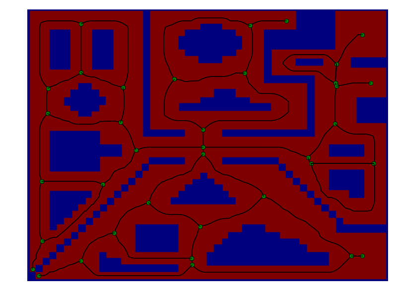

# TVD
Topological Voronoi Decomposition of an Occupancy Grid

## Build
This project uses Cython for compilation

    $ python setup.py build_ext --inplace

## Examples
For an example of how to use this code, please refer to
`examples/graph_generation_example.py`.

    $ python examples/graph_generation_example.py
